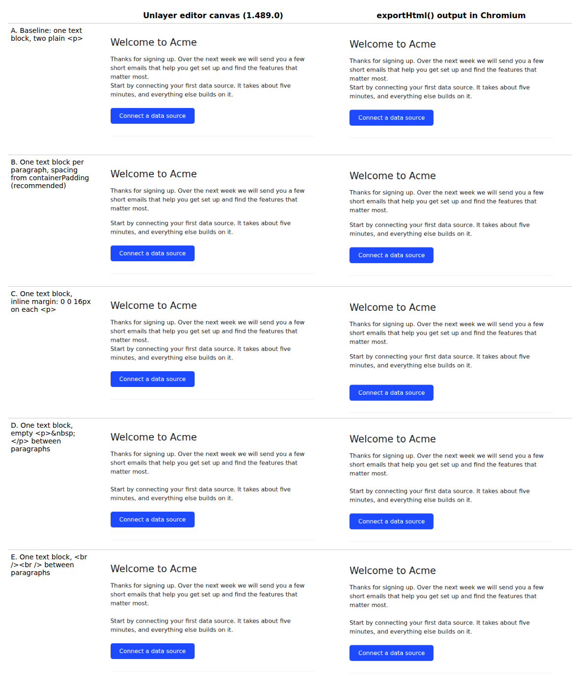

# Unlayer paragraph spacing in the editor and the exported email

Research for [Silthus/posthog#270](https://github.com/Silthus/posthog/issues/270), part of map [#268](https://github.com/Silthus/posthog/issues/268).

**Question.** Which Unlayer design pattern gives readable paragraph spacing, both in the visual editor and in the exported email html?
And what exact `values` does the editor write for `heading`, `text`, `button` (with `href`), and `divider`?

## Answer

Use **one `text` block per paragraph**, and let the block's `containerPadding` make the gap.
`containerPadding: "8px 24px"` on each text block gives a 16px gap between paragraphs.

- It is the only pattern that looks the same in the editor canvas and in the exported html, and that keeps the spacing in a block property instead of in the paragraph markup.
- Each paragraph has its own id, so `workflows-patch-action-email` changes, adds, removes, or moves one paragraph with one operation (`update_content`, `add_content`, `remove_content`, `move_content`).
- A person changes the spacing in the block's padding control, and changes the text without touching markup.
- Write the block as `type: "text"` with `values.text` html. Do not write `type: "paragraph"` without `textJson`: the editor discards the text and shows its placeholder.

## Method

There is no `UNLAYER_API_KEY` on the devbox, so the Unlayer export API (`render_design_html` in `products/messaging/backend/unlayer.py`) was not called.
Instead, a local page loads the same editor the PostHog frontend loads: `https://editor.unlayer.com/embed.js?2` (the script `react-email-editor` injects), with `projectId: 275430` and `displayMode: "email"`, as in `emailTemplaterLogic.tsx` and `EmailTemplater.tsx`.
The editor reported version `1.489.0` (`https://editor.unlayer.com/1.489.0/editor.html`).

For each pattern, a headless Chromium (Playwright) did these steps:

1. `editor.loadDesign(design)`, then a screenshot of the editor canvas.
2. `editor.exportHtml()`, then the returned html loaded into a 640px wide page and a screenshot of it.
3. `editor.saveDesign()` to read back the `values` the editor normalizes and stores.

The harness is in [`unlayer-paragraph-spacing/harness/`](unlayer-paragraph-spacing/harness/).
To run it, serve that directory on port 8765 (`python3 -m http.server 8765`), then run `node render.mjs` from it.

The exported html was rendered in Chromium only.
It was not sent to real inboxes (Gmail, Outlook, Apple Mail).

## Why plain paragraphs clump

The email export adds this global stylesheet (seen in every exported document):

```css
body{margin:0;padding:0}table,td,tr{border-collapse:collapse;vertical-align:top}p{margin:0}...
```

`p{margin:0}` removes the default paragraph margin, so two `<p>` in one text block touch.
The editor canvas does the same and more: its stylesheet has `.editable p, [contenteditable] p { position: relative; margin: 0px !important; }` (read from the canvas frame's `document.styleSheets`).

## Patterns compared



All variants use the same heading, two paragraphs (16px, `lineHeight: 150%`), a button, and a divider. Source: [`harness/designs.mjs`](unlayer-paragraph-spacing/harness/designs.mjs).

| Pattern                                                 | Editor canvas                            | Exported html                                      | Patch operations                          | Hand editing                                              |
| ------------------------------------------------------- | ---------------------------------------- | -------------------------------------------------- | ----------------------------------------- | --------------------------------------------------------- |
| A. One text block, plain `<p><p>` (baseline)            | Clumped                                  | Clumped                                            | One `update_content` rewrites all text    | Natural, but clumped                                      |
| **B. One text block per paragraph, `containerPadding`** | **16px gap**                             | **16px gap, same as canvas**                       | **One op per paragraph, addressed by id** | **Padding control in the block panel**                    |
| C. One text block, `<p style="margin: 0 0 16px;">`      | **Clumped** (the `!important` rule wins) | 16px gap, plus 16px extra under the last paragraph | Each rewrite must repeat the inline style | Invisible in the editor, so a person cannot see or fix it |
| D. One text block, `<p>&nbsp;</p>` between paragraphs   | One empty line (24px)                    | Same as canvas                                     | Each rewrite must keep the separators     | What TinyMCE writes when a person presses Enter twice     |
| E. One text block, `<br /><br />` inside one `<p>`      | One empty line (24px)                    | Same as canvas                                     | Each rewrite must keep the separators     | Fragile: Enter in the editor makes new `<p>` instead      |

Notes:

- C is the trap. The inline margin survives the editor round trip (`saveDesign` keeps it) and the export, but the canvas hides it. A person sees a clumped email in the editor and a spaced one in the inbox.
- D and E look right in both places, but the gap is a blank line of text, so its size follows `lineHeight` and `fontSize`. It is content, not a design property.
- B and D mix well. If a person later presses Enter twice inside a B paragraph, the result is D inside that block, which also renders the same in both places.

### What a person types in a text block

Typing into a `text` block (TinyMCE) and pressing Enter once and then twice gives this `values.text`:

```html
<p style="line-height: 150%;">Start by connecting ...</p>
<p style="line-height: 150%;">Typed after one Enter.</p>
<p style="line-height: 150%;">&nbsp;</p>
<p style="line-height: 150%;">Typed after two Enters.</p>
```

One Enter gives a new paragraph with no gap. Two Enters give an empty paragraph as the gap.
Screenshot: [`screenshots/hand-edit-enter.png`](unlayer-paragraph-spacing/screenshots/hand-edit-enter.png).

## `text` and `paragraph` blocks

The editor's tool panel now offers **Paragraph**, not Text.
Unlayer's changelog for 1.339.0 says: "The Text tool (based on TinyMCE) has been deprecated in favor of the new Paragraph tool powered by Lexical" and "Existing designs using the Text tool will remain functional" ([changelog 1.339.0](https://docs.unlayer.com/changelog/13390-stable-dlb7VQLA)).

Observed in editor 1.489.0:

- A dragged Paragraph block is `type: "paragraph"`. It stores a Lexical state in `values.textJson` (a JSON string) and an html copy in `values.text`, where each paragraph is `<p style="margin: 0px; margin-block: 0px;">`. An empty line is `<p ...><br></p>`. So a person who uses the Paragraph tool also gets spacing only from blank lines or from separate blocks.
- A `paragraph` block loaded with `values.text` and no `textJson` loses its text: the canvas, `saveDesign`, and `exportHtml` all show "This is a new Paragraph block. Change the text." Screenshot: [`screenshots/paragraph-type-without-textjson.png`](unlayer-paragraph-spacing/screenshots/paragraph-type-without-textjson.png).
- A `text` block loaded with only `values.text` renders, exports, and stays editable.
- A `heading` block loaded with only `values.text` (no `textJson`) renders, exports, and keeps the text. A dragged heading writes both `textJson` and `text`.
- A dragged button also writes `textJson`. A button loaded with only `values.text` renders the text.

So an agent writes `text` blocks and `values.text` html for headings and buttons. Writing `textJson` is not needed.

Side finding: `KNOWN_CONTENT_TYPES` in `products/messaging/backend/api/design_validation.py` has no `paragraph`, so a design with a Paragraph block that a person added gets an "unknown type" warning.

## `values` the editor writes

The editor fills every missing key with its default on load.
These are the `values` that `saveDesign()` returned after loading blocks with only `text` (and `href` for the button), in project 275430.
Blocks dragged in from the tool panel gave the same keys without `hideDesktop`, plus `textJson` and `_languages: {}`.
Some defaults differ from the Unlayer docs (for example the docs list button `backgroundColor: "#3AAEE0"` and `size.width: "50%"`, see [button tool](https://docs.unlayer.com/builder/tools/button)), so treat these as the 1.489.0 editor's output, not a fixed schema.

Shared keys on every block: `containerPadding: "10px"`, `anchor: ""`, `hideDesktop: false`, `displayCondition: null`, `_styleGuide: null`, `_meta: { htmlID, htmlClassNames }`, `selectable`, `draggable`, `duplicatable`, `deletable`, `hideable` (all `true`), `locked: false`.

### heading

```json
{
  "containerPadding": "10px",
  "anchor": "",
  "headingType": "h1",
  "fontSize": "22px",
  "textAlign": "left",
  "lineHeight": "140%",
  "linkStyle": {
    "inherit": true,
    "linkColor": "#0000ee",
    "linkHoverColor": "#0000ee",
    "linkUnderline": true,
    "linkHoverUnderline": true
  },
  "hideDesktop": false,
  "displayCondition": null,
  "_styleGuide": null,
  "_meta": { "htmlID": "u_content_heading_1", "htmlClassNames": "u_content_heading" },
  "selectable": true,
  "draggable": true,
  "duplicatable": true,
  "deletable": true,
  "hideable": true,
  "locked": false,
  "text": "Hello"
}
```

Exports as `<h1 style="margin: 0px; line-height: ...; font-size: ...; font-weight: 400;">`, using the block's `lineHeight` and `fontSize`.

### text

```json
{
  "containerPadding": "10px",
  "anchor": "",
  "fontSize": "14px",
  "textAlign": "left",
  "lineHeight": "140%",
  "linkStyle": {
    "inherit": true,
    "linkColor": "#0000ee",
    "linkHoverColor": "#0000ee",
    "linkUnderline": true,
    "linkHoverUnderline": true
  },
  "hideDesktop": false,
  "displayCondition": null,
  "_styleGuide": null,
  "_meta": { "htmlID": "u_content_text_1", "htmlClassNames": "u_content_text" },
  "selectable": true,
  "draggable": true,
  "duplicatable": true,
  "deletable": true,
  "hideable": true,
  "locked": false,
  "text": "<p>One</p>"
}
```

### button

```json
{
  "href": { "name": "web", "values": { "href": "https://example.com/setup", "target": "_blank" } },
  "buttonColors": {
    "color": "#FFFFFF",
    "backgroundColor": "#0879A1",
    "hoverColor": "#FFFFFF",
    "hoverBackgroundColor": "#0879A1"
  },
  "size": { "autoWidth": true, "width": "100%" },
  "fontSize": "14px",
  "lineHeight": "120%",
  "textAlign": "center",
  "padding": "10px 20px",
  "border": {},
  "borderRadius": "4px",
  "hideDesktop": false,
  "displayCondition": null,
  "_styleGuide": null,
  "containerPadding": "10px",
  "anchor": "",
  "_meta": { "htmlID": "u_content_button_1", "htmlClassNames": "u_content_button" },
  "selectable": true,
  "draggable": true,
  "duplicatable": true,
  "deletable": true,
  "hideable": true,
  "locked": false,
  "text": "Go"
}
```

The link lives in `values.href.values.href`, with `values.href.name: "web"` for a website link.
The exported anchor is `<a href="https://example.com/setup" target="_blank" class="v-button" ...>`.
An empty button defaults to `href: { "name": "web", "values": { "href": "", "target": "_blank" } }`.

### divider

```json
{
  "width": "100%",
  "border": { "borderTopWidth": "1px", "borderTopStyle": "solid", "borderTopColor": "#BBBBBB" },
  "textAlign": "center",
  "containerPadding": "10px",
  "anchor": "",
  "hideDesktop": false,
  "displayCondition": null,
  "_styleGuide": null,
  "_meta": { "htmlID": "u_content_divider_1", "htmlClassNames": "u_content_divider" },
  "selectable": true,
  "draggable": true,
  "duplicatable": true,
  "deletable": true,
  "hideable": true,
  "locked": false
}
```

## Minimal example

[`unlayer-paragraph-spacing/example-design.json`](unlayer-paragraph-spacing/example-design.json) has a heading, two text paragraphs, a button with a link, and a divider in pattern B.
It sets only the values that matter and leaves the rest to the editor's defaults.
[`example-design.editor-saved.json`](unlayer-paragraph-spacing/example-design.editor-saved.json) is the same design after a `loadDesign` and `exportHtml` round trip, with every default filled in.

| Block     | `containerPadding` | Gap it makes                                         |
| --------- | ------------------ | ---------------------------------------------------- |
| heading   | `32px 24px 8px`    | Room above the headline, 16px to the first paragraph |
| each text | `8px 24px`         | 16px between paragraphs                              |
| button    | `16px 24px`        | 24px from the last paragraph                         |
| divider   | `16px 24px`        | 32px under the button                                |

Editor canvas and export of the example: [`screenshots/example-design.editor.png`](unlayer-paragraph-spacing/screenshots/example-design.editor.png), [`screenshots/example-design.export.png`](unlayer-paragraph-spacing/screenshots/example-design.export.png).
The Liquid tag in the heading stays as text in the export, so the send step renders it.

### Patch operations on the example

`apply_design_operations` (`products/messaging/backend/api/design_operations.py`) ran these operations on the example, and the result was loaded into the editor and exported:

```json
[
  {
    "op": "update_content",
    "id": "button-setup",
    "patch": { "values": { "href": { "values": { "href": "https://example.com/docs/connect" } } } }
  },
  {
    "op": "update_content",
    "id": "text-next-step",
    "patch": { "values": { "text": "<p>Connect a data source first. It takes about five minutes.</p>" } }
  },
  {
    "op": "add_content",
    "column_id": "col-main",
    "index": 3,
    "content": {
      "type": "text",
      "values": {
        "text": "<p>Need help? Reply to this email.</p>",
        "fontSize": "16px",
        "lineHeight": "150%",
        "containerPadding": "8px 24px"
      }
    }
  }
]
```

- The deep merge changed only the link: `{ "name": "web", "values": { "href": "https://example.com/docs/connect", "target": "_blank" } }`.
- The new paragraph got id, `_meta.htmlID: "u_content_text_3"`, and `counters.u_content_text: 3`.
- The export has the new link and three evenly spaced paragraphs: [`screenshots/after-patch-operations.png`](unlayer-paragraph-spacing/screenshots/after-patch-operations.png).
- A new paragraph needs its own `containerPadding` (and font values). Without it, it gets the editor default `10px` and 14px text and does not match its neighbors.

## Sources

- Unlayer editor 1.489.0, loaded from `https://editor.unlayer.com/embed.js?2` with project 275430: canvas rendering, `saveDesign()`, `exportHtml()`, and the canvas stylesheet (harness in this directory).
- [Unlayer changelog 1.339.0](https://docs.unlayer.com/changelog/13390-stable-dlb7VQLA): Text deprecated in favor of the Lexical Paragraph tool.
- [Unlayer button tool](https://docs.unlayer.com/builder/tools/button): documented button defaults.
- [Unlayer content types](https://docs.unlayer.com/design-schema/content-types), [heading tool](https://docs.unlayer.com/builder/tools/heading), [divider tool](https://docs.unlayer.com/builder/tools/divider), [paragraph tool](https://docs.unlayer.com/builder/tools/paragraph): the docs list no paragraph spacing property. `containerPadding` and `lineHeight` are the only spacing controls.
- PostHog code: `frontend/src/scenes/hog-functions/email-templater/EmailTemplater.tsx` and `emailTemplaterLogic.tsx` (editor options and project id), `products/messaging/backend/unlayer.py`, `products/messaging/backend/api/design_operations.py`, `products/messaging/backend/api/design_validation.py`.
